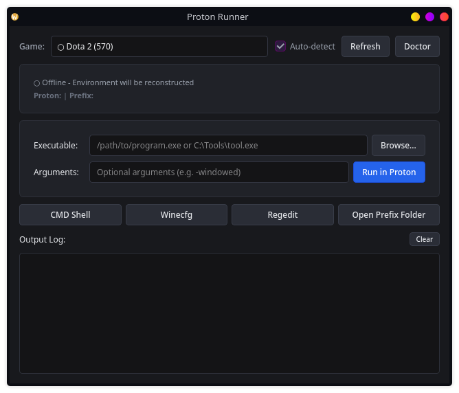

# proton-runner



Run auxiliary Windows tools (`.exe`, `.bat`, mod loaders, debugging utilities) and Linux commands inside a Steam game's Proton environment without modifying game launch options.

Supports live process detection: if the game is already running, `proton-runner` attaches to its active Proton environment and Wine prefix automatically. If offline, it reconstructs the environment from Steam libraries and `compatdata`.

Available as both a CLI tool and a fast, compact Qt6 desktop GUI (< 0.15s instant startup).

---

## Features

- **Instant GUI Startup (< 0.15s):** Asynchronous non-blocking architecture ensures the window renders immediately while Steam libraries and games are discovered in the background.
- **Process Auto-Detection:** Inspects `/proc/<pid>/environ` (safely via NUL-byte parsing) to capture live `STEAM_COMPAT_*` variables, `WINEPREFIX`, and Proton binary paths in real time.
- **Offline Environment Reconstruction:** Finds installed games, compatdata prefixes, and Proton versions across multiple Steam library folders (`libraryfolders.vdf`).
- **Path Handling:** Translates Linux absolute/relative paths and Windows drive paths (`C:\...`, `Z:\...`).
- **Prefix Utilities:** One-click / one-command shortcuts to launch `cmd.exe`, `winecfg`, `regedit`, or open the prefix directory.
- **Doctor Diagnostics:** Built-in health check for Steam libraries, filesystems (with NTFS warnings), prefix permissions, and Proton installations.
- **Smart Caching:** Caches static library data in `~/.cache/proton-runner/` with automatic refresh on change.

---

## Installation

Clone the repository and copy the executables to your user `$PATH`:

```bash
git clone https://github.com/your-user/proton-runner.git
cd proton-runner

mkdir -p ~/.local/bin ~/.local/share/applications
cp proton-runner proton_runner_gui.py ~/.local/bin/
cp proton-runner.desktop ~/.local/share/applications/
chmod +x ~/.local/bin/proton-runner ~/.local/bin/proton_runner_gui.py
```

Make sure `~/.local/bin` is in your `$PATH` (in `~/.bashrc` or `~/.zshrc`):
```bash
export PATH="$HOME/.local/bin:$PATH"
```

---

## Usage

### Desktop GUI
Launch from your application menu or run:
```bash
proton-runner
# or
proton-runner gui
```

#### Performance & Benchmark Mode
Measure startup timings:
```bash
proton-runner gui --timing
```

### CLI Commands

#### Run an Executable in a Game's Prefix
```bash
# Linux path
proton-runner run 3513350 ~/Tools/mod_manager.exe

# Windows drive path
proton-runner run 3513350 "C:\Tools\tool.exe" --debug
```

#### Open Windows Command Prompt
```bash
proton-runner cmd 3513350
```

#### Run Wine Configuration or Tools
```bash
proton-runner wine 3513350 winecfg
proton-runner wine 3513350 regedit
proton-runner wine 3513350 explorer.exe
```

#### Run Native Linux Programs in Proton Environment
```bash
proton-runner native 3513350 bash
proton-runner native 3513350 env
```

#### Inspect Game Environment
```bash
# Summary info (paths, prefix, Proton version, filesystems)
proton-runner info 3513350

# Print exportable environment variables
proton-runner env 3513350
```

#### List Running Games
```bash
proton-runner list
```

#### Diagnostics
```bash
# Check global Steam/Proton setup
proton-runner doctor

# Check specific game prefix & filesystems
proton-runner doctor 3513350
```

---

## Architecture & Performance

`proton-runner` uses a multi-tiered architecture:
1. **Immediate Rendering:** `window.show()` is called first (< 0.15s).
2. **Asynchronous Library Discovery:** `FastDiscoveryWorker` scans Steam libraries in a separate background thread (`QThread`) without blocking the main event loop.
3. **Non-blocking Process Polling:** `ProcessScanWorker` inspects `/proc` without spawning blocking subshells.
4. **Lazy Detail Loading:** Prefix and Proton paths are retrieved on-demand and cached in memory.

---

## License

This project is licensed under the [MIT License](LICENSE).
